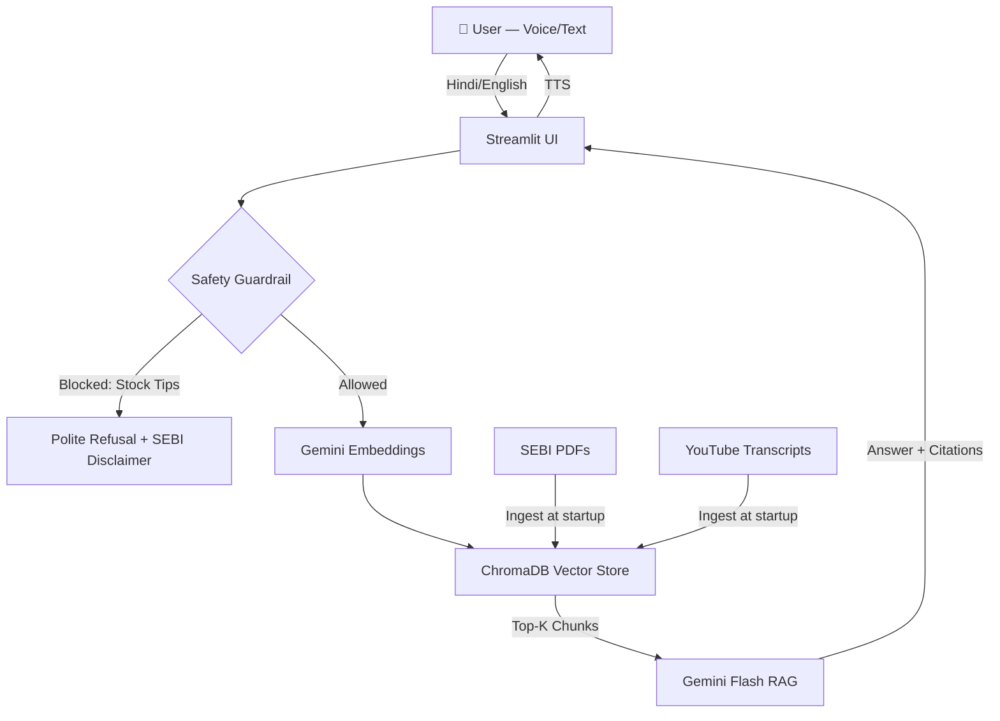

# Bharat Financial Literacy & Fraud Resilience Companion

<div align="center">

🇮🇳 **Voice-First AI Investor Education & Fraud Detection — Built for Bharat**

[](https://python.org)
[](https://streamlit.io)
[](https://ai.google.dev)
[](https://www.trychroma.com)
[](LICENSE)

</div>

---

## 🎯 What Is This?

A **regional voice-first AI companion** that helps first-time and Tier-2/3 investors in India:

- 🗣️ **Ask financial questions in Hindi or English** via voice or text
- 📚 **Get answers backed by SEBI documents** with exact page citations
- 🎥 **Watch relevant video clips** with precise timestamps
- 🚨 **Detect investment fraud** — WhatsApp scams, guaranteed-return traps
- 🧠 **Test their fraud-recognition skills** via an adaptive quiz

> ⚠️ **ZERO stock tips.** ZERO buy/sell advice. ZERO broker promotions. Ever.

---

## 🏗️ Architecture



---

## 🚀 Quick Start (3 Commands)

```bash
# 1. Clone & enter the repo
git clone <your-repo-url>
cd "Bharat Financial Literacy & Fraud Resilience Companion"

# 2. Install dependencies
pip install -r requirements.txt

# 3. Set your Gemini API key and run
cp .env.example .env
# Edit .env and add your GEMINI_API_KEY
streamlit run app.py
```

Open [http://localhost:8501](http://localhost:8501) in **Chrome** (required for Web Speech API).

---

## 📁 Project Structure

```
├── app.py                    # 🚀 Main Streamlit application
├── requirements.txt          # Python dependencies
├── .env.example              # Environment variable template
├── .streamlit/
│   └── config.toml           # Streamlit theme + server config
│
├── config/
│   └── settings.py           # Centralized configuration
│
├── data/
│   ├── pdfs/                 # Pre-committed SEBI awareness PDFs
│   └── transcripts/          # Cached YouTube transcript JSONs
│
├── ingestion/
│   ├── pdf_loader.py         # PDF chunker with page metadata
│   └── youtube_loader.py     # YouTube transcript fetcher + chunker
│
├── rag/
│   ├── embedder.py           # Gemini text-embedding-004 wrapper
│   ├── vector_store.py       # ChromaDB in-memory client
│   ├── retriever.py          # Semantic search
│   └── generator.py          # RAG chain + citation formatter
│
├── guardrails/
│   └── safety_filter.py      # Regex + LLM safety filter
│
├── quiz/
│   ├── quiz_engine.py        # Adaptive quiz logic
│   └── questions.py          # Question bank (3 difficulty levels)
│
├── voice/
│   └── speech_component.py   # Web Speech API JS bridge
│
├── ui/
│   ├── components.py         # Reusable Streamlit UI blocks
│   └── styles.py             # Custom CSS
│
└── tests/                    # Unit tests
```

---

## 🔐 Safety Guardrails

This app enforces **SEBI-aligned safety rules** at two layers:

| Layer | Mechanism | What It Blocks |
|-------|-----------|----------------|
| Pre-LLM | Regex pattern matching | Stock tips, price targets, "guaranteed returns" |
| Post-LLM | Gemini self-verification | Any advice that slipped through pre-filter |

All refusals include a pointer to SEBI's official investor grievance portal.

---

## 🧪 Running Tests

```bash
pytest tests/ -v
```

---

## 🔑 Environment Variables

| Variable | Required | Description |
|----------|----------|-------------|
| `GEMINI_API_KEY` | ✅ Yes | Google AI Studio API key |
| `APP_ENV` | No | `development` / `production` |
| `LOG_LEVEL` | No | `INFO` / `DEBUG` |

---

## 📜 License

MIT License — see [LICENSE](LICENSE)

---

## ⚠️ Disclaimer

This application is for **educational purposes only**. It does not constitute financial advice.
All information is sourced from publicly available SEBI investor awareness materials.
Always consult a SEBI-registered investment advisor before making investment decisions.
